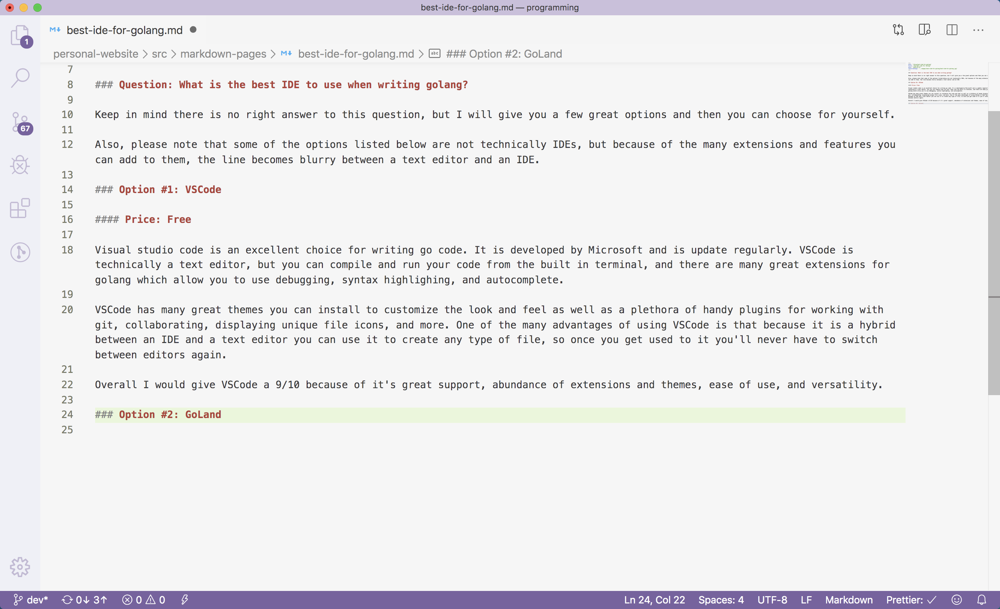
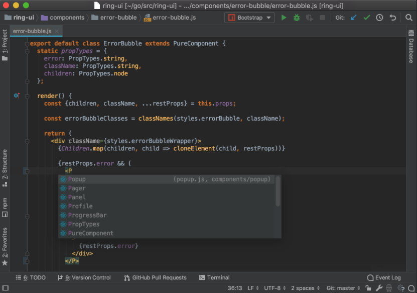
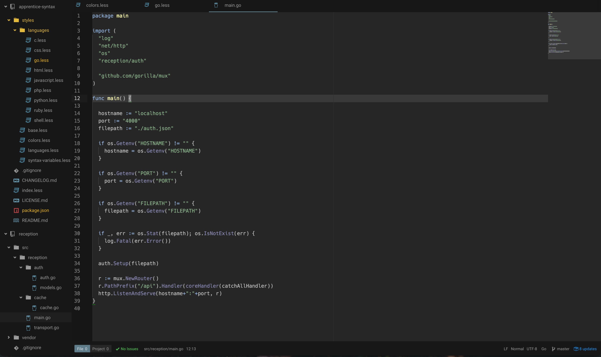

### Question: What is the best IDE to use when writing golang?

Keep in mind there is no right answer to this question, but I will give you a few great options and then you can choose for yourself.

Also, please note that some of the options listed below are not technically IDEs, but because of the many extensions and features you can add to them, the line becomes blurry between a text editor and an IDE.

### Option #1: VSCode

#### Price: Free

Visual studio code is an excellent choice for writing go code. It is developed by Microsoft and is updated regularly. VSCode is technically a text editor, but you can compile and run your code from the built in terminal, and there are many great extensions for golang which allow you to use debugging, syntax highlighing, and autocomplete.

####Top Features

<ul class="pl-10 mb-5 mt-5 list-disc">
    <li class="mb-2 text-lg">Excellent built in terminal</li>
    <li class="mb-2 text-lg">Light and dark themes</li>
    <li class="mb-2 text-lg">Plug-ins for git, docker, and databases</li>
    <li class="mb-2 text-lg">Intellisense autocompletion plug-ins</li>
    <li class="mb-2 text-lg">Documentation help</li>
    <li class="mb-2 text-lg">Frequent updates</li>
</ul>

VSCode has many great themes you can install to customize the look and feel as well as a plethora of handy plugins for working with git, collaborating, displaying unique file icons, and more. One of the many advantages of using VSCode is that because it is a hybrid between an IDE and a text editor you can use it to create any type of file, so once you get used to it you'll never have to switch between editors again. In fact, I'm using VSCode to write this post right now!

<b>Overall I would give VSCode an 8/10</b> because of it's great support, abundance of extensions and themes, ease of use, and versatility.

<a class="text-blue-500 no-underline- hover:underline" href="https://code.visualstudio.com/">You can download VSCode here</a>

### Option #2: GoLand

#### Price: \$199.00/year

Goland is a golang IDE created by JetBrains. It has excellent support for go, including error detection, intelligent code completion, and documentation hints. It has support for git and github, a rich debugger and supports JavaScript, TypeScript, NodeJS, SQL, and Docker.

####Top Features

<ul class="pl-10 mb-5 mt-5 list-disc">
    <li class="mb-2 text-lg">Error detection</li>
    <li class="mb-2 text-lg">Debugging</li>
    <li class="mb-2 text-lg">Autocompletion</li>
    <li class="mb-2 text-lg">Built in temrinal</li>
</ul>

JetBrains makes excellent products and Goland is no exception. However, it does come at a hefty price tag. <b>You can get a year license for \$199.00.</b> If you'd like to give it a try before buying they do offer a
<a class="text-blue-500 no-underline- hover:underline" href="https://www.jetbrains.com/go/">30 day free trial.</a>

If Goland was free, I would give it a 8/10, but because of the hefty price tag, <b>I'm going to give it a 7/10.</b>

### Option #3: Atom

#### Price: Free

Atom is an editor developed by GitHub. It has plug-in support for golang, git, autocompletion, offers easy customization and comes with some great light and dark themes.

####Top Features

<ul class="pl-10 mb-5 mt-5 list-disc">
    <li class="mb-2 text-lg">Light and dark themes</li>
    <li class="mb-2 text-lg">Plug-ins for anything you can imagine</li>
    <li class="mb-2 text-lg">Customizable</li>
    <li class="mb-2 text-lg">Github integration</li>
</ul>

Atom is an excellent, editor but many people in the development community have moved away from atom to favor VSCode. This means that there are not as many people developing and maintaining the plugin-ins or themes.

<b>I'd give atom a 7/10</b>

<a class="text-blue-500 no-underline- hover:underline" href="https://atom.io/">You can download atom here</a>
