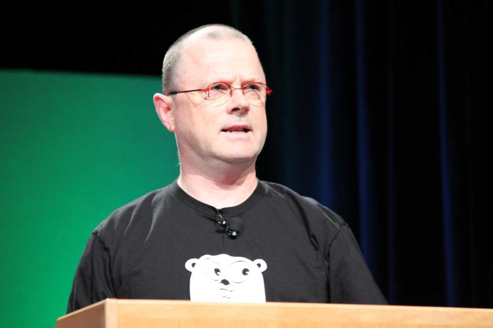
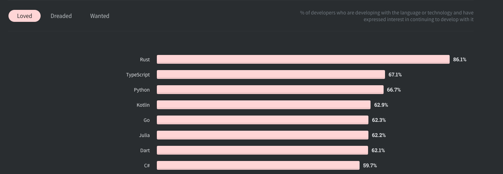
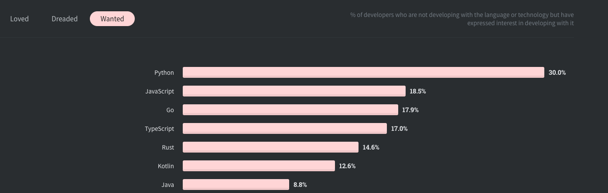
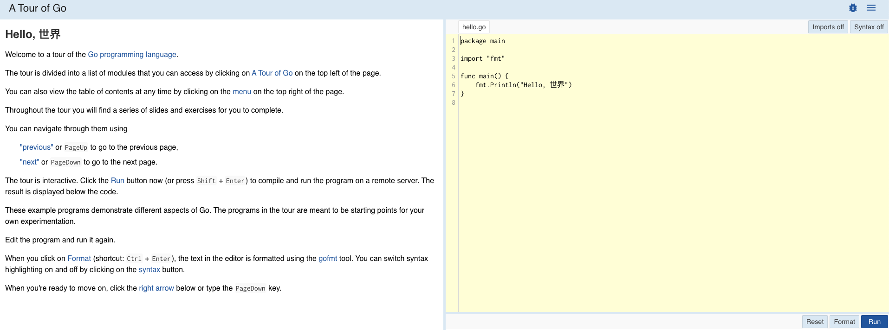

### What's Up With The Go Programming Language?

The go programming language was launched in 2009 as an open-source programming language.
It is a statically typed, compiled language that has built in support for concurrency.

It was originally designed by Robert Griesemer, Ken Thompson and Rob Pike at Bell Labs to be the programming language
of modern software development and was built to be simple, reliable and efficient.

Robert Griesemer

Ken Thompson

Rob Pike

### What The Go Programming Language Is Used For

Go is a general purpose language so you can use it for pretty much anything.

**_But, the main uses of go is for writing networking applications such as TCP or HTTP web servers._**
It is very fast and because of it's excellent support for concurrency it makes handling thousands of requests
per second a breeze.

It has a built in networking package that allows you to have a simple Http web server up and running with only
a few lines of code and no third party packages.

    package main

    import "net/http"

    func main() {

        http.HandleFunc("/", func(w http.ResponseWriter, r *http.Request) {
            w.Write([]byte("hello world!"))
        })

        http.ListenAndServe(":8080", nil)

    }

There you have it, a fully functional web server written in Go!

**_A secondary use of Go is for writing systems applications_**

#### Popular Systems Applications Written In Go

<ul class="pl-10 mb-5 mt-5 list-disc">
    <li class="mb-2 text-lg"><a class="text-blue-500 no-underline- hover:underline" href="https://www.docker.com/">Docker</a></li>
    <li class="mb-2 text-lg"><a class="text-blue-500 no-underline- hover:underline" href="https://etcd.io/">Etcd</a></li>
    <li class="mb-2 text-lg"><a class="text-blue-500 no-underline- hover:underline" href="https://prometheus.io/">Prometheus</a></li>
    <li class="mb-2 text-lg"><a class="text-blue-500 no-underline- hover:underline" href="https://kubernetes.io/">Kubernetes</a></li>
</ul>

### Should You Learn The Go Programming Language?

According to the 2020 stack overflow developer survey. Go is ranked as the fifth **_most loved programming language._**
This means that once people use Go they like to keep using it. Meaning more and more jobs will be popping up requiring go skills in the future.

Not only this, but Go was also ranked number three for **_most wanted language_**. Which means developers want to learn go or use it in their work.

It seems like people who are using go want to keep using it and people who haven't tried it yet want to give it a try. This will mean more jobs and opportunities available for go developers in the future. So it would be a safe bet to start learning go now!

### How To Learn The Go Programming Language

Learning a new language can be difficult and often an overview of the features and a quick walkthrough are the best places to start.

I'd recommend taking <a class="text-blue-500 no-underline- hover:underline" href="https://tour.golang.org/welcome/1">a tour of go</a> to get started with learning.

Thanks for reading about the go programming language. I hope you found this article helpful in understanding what go is, why it's used and if you should learn it.

Stick around for more articles and tutorials about go.
