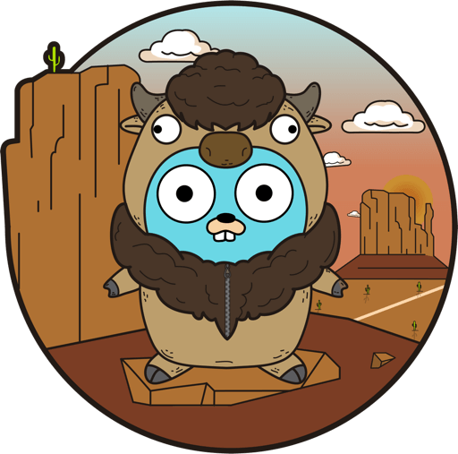

### Question: What's the top golang web framework for 2020?

If you are starting out a new project, then it's important to pick the right tools for the job. <b>Although a framework is not always necessary, it can make many things such as middleware, authentication, caching, and logging much easier.</b> Because of this, many developers choose to start their project off with a framework, and with golangs growing popularity there are quite a number of options to choose from.

#### The goal of this post is to help you find the right web framework for your applicaiton

### Option 1: Buffalo

> "While Buffalo can be considered as a framework, it's mostly an ecosystem of Go and Javascript libraries curated to fit together." - buffalo docs

Buffalo is a flexible collection of libraries that allows you to pick and choose the exact features you want and leave behind the ones you don't.

#### Some of the main features of Buffalo

<ul class="pl-10 mb-5 mt-5 list-disc">
    <li class="mb-2 text-lg">Routing with gorilla/mux</li>
    <li class="mb-2 text-lg">Pop for connecting and working with databases</li>
    <li class="mb-2 text-lg">Plush for templating</li>
    <li class="mb-2 text-lg">Packr for bundling your static assets</li>
</ul>
