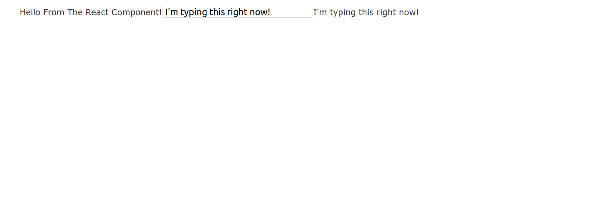

### What we're going to do

In this article we are going to walk through how to use React in a Ruby on Rails project. 
Ruby on Rails is still an excellent choice for your backend and in this article you will see why.

Rails allows for extremely fast development, and coupled with a React frontend, you can create robust and interactive
web apps at lightning speed!

In this guide I'm assuming you are using a recent version of Ruby and Rails version 6.\*.\*

If you don't have these installed then you can get started by going <a class="text-blue-500 no-underline hover:underline" href="https://www.ruby-lang.org/en/documentation/installation/">here</a> for Ruby and <a class="text-blue-500 no-underline hover:underline" href="https://guides.rubyonrails.org/v5.0/getting_started.html">here</a> for Rails.

We will first create an initial rails application, then add the necessary gems to get react to work with rails. 

At the end of this tutorial, you should have a Rails application set up to work with React. You will be able to create reusable React components and mix and match erb with react as needed.

Let's get started!

Go ahead and run the following command to generate a new Rails project.

```bash
rails new rails_with_react
```

This is somewhat like `create-react-app` if you are coming from the React world.

change directories into your new Rails project

```bash
cd rails_with_react
```

We will now install the gems required to use React with Rails.

Add the `gem 'react-rails'` to your `Gemfile`

```ruby
gem 'react-rails'
```

Gemfiles are like `package.json` files, they keep track of your dependencies.

Run bundle install to fetch this gem from rubygems.org

```bash
bundle install
```

Then run the install commands for the gem

```bash
rails generate react:install
rails webpacker:install:react
```

These commands set up a `app/javascript/component/` directory and add a few lines to your `app/javascript/packs/application.js` file.

Now that you have the react-rails gem installed, it's time to put it to work.

Let's run the following command to generate our first React component.

```bash
rails g react:component FirstComponent
```

Go to your `app/javascript/components/` directory and you will see a new file called `FirstComponent.js` Nice work!

If you've had any problems up until this point you should check that you are using the correct version of rails and ruby. Please leave a comment below if you are having any issues with this tutorial.

We now have our first component built (which is great!), but we still need to put it in one of our views so our users can see it.

Let's run the rails scaffolding command so we have a place to render our React component

```bash
rails g scaffold random_name
```

Go to your newly generated `views/random_name/index.html.erb` template.

Erb templates are Rails way of doing dynamic frontend content, however, we are just going to use it to render a React app.

Let's put the following line in the index template.

```ruby
# /views/random_name/index.html.erb
<%= react_component("FirstComponent") %>
```

Migrate your database

```bash
rails db:migrate
```

And now you can start up your app!

```bash
rails s
```

Open up your browser and go to `localhost:3000/random_name` in order to render the `random_name/index.html.erb` template.

At this point your component will be rendering to the page, however, your component doesn't have any content to display, let's go add some.

Open up `app/javascript/components/FirstComponent.js`

It should look like this

```jsx
// app/javascript/components/FirstComponent.js
import React from 'react'
import PropTypes from 'prop-types'
class FirstComponent extends React.Component {
  render() {
    return (
      <React.Fragment>
      </React.Fragment>
    );
  }
}

export default FirstComponent
```

Let's go ahead and add some text in this component so we can see it on the screen.

```jsx
// app/javascript/components/FirstComponent.js
import React from 'react'
import PropTypes from 'prop-types'
class FirstComponent extends React.Component {
  render() {
    return (
      <React.Fragment>
      // highlight-next-line
       Hello From The React Component! 
      </React.Fragment>
    );
  }
}

export default FirstComponent
```

You should see the text "Hello From The React Component!" displayed on your screen.


If you don't, then something went wrong in one of the above steps, you can ask for help down below or go back and retry some of them to see if they work the second time.

Let's add a little bit of extra functionality to our React component.

First we will add an input box.

```jsx
// app/javascript/components/FirstComponent.js
import React from 'react'
import PropTypes from 'prop-types'
class FirstComponent extends React.Component {
  render() {
    return (
      <React.Fragment>
       Hello From The React Component!
      // highlight-next-line
       <input type="text">
      </React.Fragment>
    );
  }
}

export default FirstComponent
```

Then add a function that we will call when our input box changes and an initial state for our component.

```jsx
// app/javascript/components/FirstComponent.js
import React from 'react'
import PropTypes from 'prop-types'
class FirstComponent extends React.Component {
  constructor() {
    // highlight-next-line
    state = {userInput: ""}
    // highlight-next-line
    this.onUserInput = this.onUserInput.bind(this)
  }

  // highlight-start
  onUserInput(e) {
    this.setState({
      userInput: e.target.value
    })
  }
  // highlight-end

  render() {
    return (
      <div>
       Hello From The React Component!
      // highlight-next-line
       <input type="text" onChange={(e) => this.onUserInput(e)} />
      // highlight-next-line
       <span>{this.state.userInput}</span>
      </div>
    );
  }
}

export default FirstComponent
```

You should now see the following and be able to type into your input box and see the result!



At this point we have a fully functioning React component, which we can extend into a robust React application. However, React has switched to a functional style of component that is more commonly used these days.

Let's do a quick refactoring of our component to use this new functional style!

I'll show the finished refactoring first, then we will walk through each part of it together.

```jsx
// app/javascript/components/FirstComponent.js
import React, {useState} from "react"
import PropTypes from "prop-types"
export default function FirstComponent() {
  const [userInput, setUserInput] = useState("");

  return (
    <div>
      Hello From The React Component!
      <input type="text" onChange={(e) => setUserInput(e.target.value)} />
      <span>{userInput}</span>
    </div>
    )
 }
```

Just by looking at the refactoring using the new functional style, you can see why the React community has switched over. I think it is much more readable and less code overall.

Let's go line by line of the new refactoring and explain what's going on.

As you can see we still import React, however we no longer import `Component`, instead we are importing what is know as a "hook" called `useState`.

We store our state in the `useState` hook instead of in the constructor by using `this.state` like we did before.

```jsx
// app/javascript/components/FirstComponent.js
// highlight-next-line
import React, {useState} from "react"
import PropTypes from "prop-types"
export default function FirstComponent() {
  const [userInput, setUserInput] = useState("");

  return (
    <div>
      Hello From The React Component!
      <input type="text" onChange={(e) => setUserInput(e.target.value)} />
      <span>{userInput}</span>
    </div>
    )
 }
```

The next thing you will notice is we are no longer using a `class` we are using a plain old javascript function.

Because of this we can also get rid of the `constructor` method and the `render` method.

```jsx
// app/javascript/components/FirstComponent.js
import React, {useState} from "react"
import PropTypes from "prop-types"
// highlight-next-line
export default function FirstComponent() {
  const [userInput, setUserInput] = useState("");

  return (
    <div>
      Hello From The React Component!
      <input type="text" onChange={(e) => setUserInput(e.target.value)} />
      <span>{userInput}</span>
    </div>
    )
 }
```

Here you can see we are using the `useState` hook, that we imported above, in order to set an initial state of an empty string `""`
and to give us a `setter` function `setUserInput` that we can use to update the state.

```jsx
// app/javascript/components/FirstComponent.js
import React, {useState} from "react"
import PropTypes from "prop-types"
export default function FirstComponent() {
  // highlight-next-line
  const [userInput, setUserInput] = useState("");

  return (
    <div>
      Hello From The React Component!
      <input type="text" onChange={(e) => setUserInput(e.target.value)} />
      <span>{userInput}</span>
    </div>
    )
 }
```
Finally, we use our new `setUserInput` function in order to update the state whenever the user types into our input box.

```jsx
// app/javascript/components/FirstComponent.js
import React, {useState} from "react"
import PropTypes from "prop-types"
export default function FirstComponent() {
  const [userInput, setUserInput] = useState("");

  return (
    <div>
      Hello From The React Component!
        // highlight-next-line
      <input type="text" onChange={(e) => setUserInput(e.target.value)} />
      <span>{userInput}</span>
    </div>
    )
 }
```

At this point your app should be working the exact same as it was before we did our refactoring. It is recommended that you use this
new functional style when creating new React components.

Thank you very much for taking the time to go through this Rails & React tutorial, I hope you learned something new!

If you had any trouble during this tutorial feel free to reach out to me and I'll do my best to help you debug.

If you're interested in more Ruby and Rails content you can check out this post I wrote about <a class="text-blue-500 no-underline hover:underline" href="/blog/the_ruby_programming_language_review">The Ruby Programming Language</a>