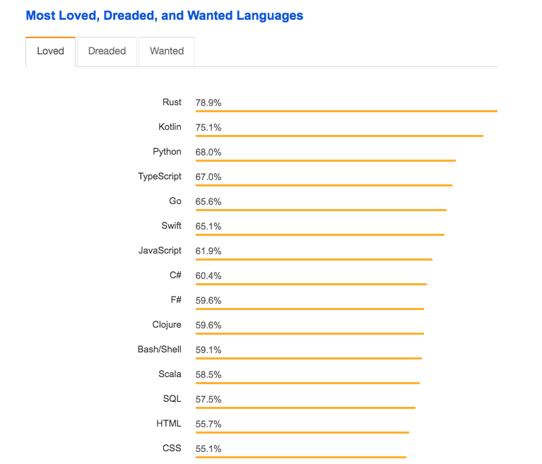

### Question: What are the top programming languages for 2020 and beyond?

The tech space moves fast, and it can be difficult to determine which programming languages are worth learning. To help determine which programming languages will be the "top/best" for you to learn in 2020, I am first going to break down what the "top" means.

For the purposes of this article, the "top" programming languages will have the following characteristics. They will be in <b>high demand</b> and will have a <b>high probability of their demand going up in the future.</b> Not only will the "top" programming languages have high demand, but <b>they will allow you to get a high paying job in an industry where you can grow and develop valuable domain knowledge.</b> This domain knowledge will further contribute to your future success.

#### Criteria for the top programming language

<ul class="pl-10 mb-5 mt-5 list-disc">
    <li class="mb-2 text-lg">High probability for growth in 2020 and beyond</li>
    <li class="mb-2 text-lg">Substantial median salary</li>
    <li class="mb-2 text-lg">Requirement for jobs in exciting and expanding industries</li>
    <li class="mb-2 text-lg">Potential for growth of valuable domain knowledge</li>
</ul>

Even with the definition of "top" as defined above, there is sure to be some personal bias when it comes to deciding what the "top" programming languages are. A lot of it will have to do with what type of projects you like to work on and in what type of work environment you enjoy.

### 1. Python

<em class="text-xs">This chart originally produced by <a class="text-blue-500 no-underline- hover:underline" href="https://www.manosantoniou.com/post/predicting-the-future-popularity-of-programming-languages/">Manos Antoniou</a></em>

<b>By looking at data from Stack Overflow, we can see that Python is set for a medioric rise in popularity.</b> Not only does Python have excellent growth potential, but it is also an in demand skill for some of the highest paying jobs in new and exciting industries.

A quick search on glassdoor shows us that most jobs requiring Python are for data scientists, web developers, and machine learning engineers. The domain knowledge one can learn from working in one of these jobs is extremely valuable, and the companies that employee for these jobs usually have a "fun" startup culture and pay extremely well. <b>At the time of this article there were 778 jobs on glassdoor with salaries between $64K-$214K for jobs requiring Python</b>

Not only does Python have some of the best projected growth, excellent jobs, and high pay, but it is also one of the easiest languages to pick up. It's interpreted nature means there is no need to deal with compiling or typing your variables. There are also hundreds of excellent beginner Python tutorials on youtube and around the web.

We highly suggest learning Python to increase your future chances of landing a high paying job in 2020 and beyond.

#### Python wins our top spot for best programming language to learn in 2020

### 2. JavaScript

<b>JavaScript has exploded in popularity in the last couple of years.</b> One of the major reasons behind this massive growth is JavaScripts versatility. With Node.js bringing JavaScript to the server side and the popularity of frameworks such as React, Angular, and Vue, JavaScript is absolutely dominating the web development space. Many companies are using JavaScript for their entire stack and with the increasing complexity of front end work, there is a huge need for experienced JavaScript developers.

#### This chart counts currently open job postings mentioning a particular framework.

<em class="text-xs">This chart originally produced by <a class="text-blue-500 no-underline- hover:underline" href="https://medium.com/javascript-scene/top-javascript-frameworks-and-topics-to-learn-in-2020-and-the-new-decade-ced6e9d812f9">Eric Elliott</a></em>

With such a large supply of jobs and great pay, currently the average JavaScript developers salary is $115,377/year (<a class="text-blue-500 no-underline- hover:underline" href="https://www.indeed.com/career/javascript-developer/salaries">source</a>), JavaScript seems like a no brainer language to learn.

JavaScript, like Python, is an interpreted language with no strict types, so it is easy to pick up. Not only this, but there are thousands of great bootcamps around the country that focus on teaching JavaScript and a couple of JavaScript frameworks. These bootcamps can have you up and running with JavaScript in just a few months.

We would highly recommend checking out <a class="text-blue-500 no-underline- hover:underline" href="https://www.freecodecamp.org/">freeCodeCamp</a> to get your feet wet learning JavaScript.

### 3. Go

Go is a programming language supported by Google. It was made to be easy to write, performant, reliable, and to work well with concurrency. Go is quickly gaining popularity as a go to language for the back end and many companies are switching over. 

Kevin Dangoor, from Khan Academy recently wrote a great post about <a class="text-blue-500 no-underline- hover:underline" href="https://engineering.khanacademy.org/">moving their back end from Python to Go</a>

Go is still a lesser known language and there are definitely not as many jobs available as Python or JavaScript, but if you already know a couple of other languages, learning it can be a great boost to your resume and help you stand out from the crowd. It is also advantages to learn Go while it is still lesser known because when a company does need a Go developer, you will have less compeition for jobs and can use this to your advantage to get a higher salary.

#### Go was recently voted the fifth most loved language, according to a poll on stack overflow

<em class="text-xs"><a class="text-blue-500 no-underline- hover:underline" href="https://insights.stackoverflow.com/survey/2018/#most-loved-dreaded-and-wanted">stackoverflow source</a></em>

### Conclusion

Our top 3 programming languages to learn for 2020 are:

<ol class="pl-10 mb-5 mt-5 list-decimal">
    <li class="mb-2 text-lg">Python for its high probability of growth, excellent median salary and the opportunity to work in new and exciting fields</li>
    <li class="mb-2 text-lg">JavaScript for its increasing ubiquity, ease of use and plethora of jobs</li>
    <li class="mb-2 text-lg">Go for it's future growth, uniqueness and high salaries.</li>
</ol>

If your favorite programming language wasn't on our list, please make sure to leave a comment letting us know why it should be. Thanks for reading and I hope you have an incredible 2020!
